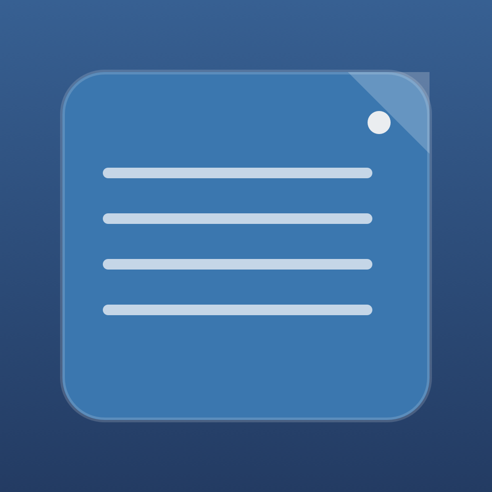

<p align="center">
  
</p>

<h1 align="center">Mac Stickies</h1>

<p align="center">
  <strong>Lightweight menu bar sticky notes for your Mac desktop.</strong><br>
  <em>Create floating notes, pin them, color them, and keep everything saved locally.</em>
</p>

<p align="center">
  <a href="#features">Features</a> &bull;
  <a href="https://github.com/georgekgr12/Mac_Stickies/releases/latest/download/MacStickies.zip">Download</a> &bull;
  <a href="#building-and-running">Build</a> &bull;
  <a href="#how-it-works">Usage</a> &bull;
  <a href="#license">License</a>
</p>

<p align="center">
  <a href="https://github.com/georgekgr12/Mac_Stickies/releases/latest/download/MacStickies.zip"><strong>Download Mac Stickies for macOS</strong></a>
</p>

---

> **This project is abandoned and no longer maintained.** The app is fully functional as-is, but no further updates, bug fixes, or feature additions will be made. Feel free to fork it and make it your own under the MIT License.

A lightweight menu bar sticky notes app for macOS, built with SwiftUI and AppKit. No external dependencies.

## Features

- Menu bar app with no dock icon clutter
- Create unlimited sticky notes that float on your desktop
- Drag and resize notes anywhere, across all Spaces
- Edit note title and body with live auto-save
- Pin notes to keep them always on top
- 6 built-in color themes: Ocean, Forest, Plum, Cherry, Slate, Amber
- Show or hide individual notes, or all notes at once
- Export and import notes as JSON backups
- Notes persist locally and restore automatically on launch
- Keyboard shortcuts: Cmd+N for a new note, Cmd+Q to quit

## Requirements

- macOS 13 Ventura or later
- Xcode 15+ with Swift 5.9+

## Building and Running

### Option 1: Xcode

```bash
git clone https://github.com/karagioules/OSX_Desktop_Sticky_Notes.git
cd OSX_Desktop_Sticky_Notes
```

Open `Package.swift` in Xcode, select the **StickyNotesApp** scheme, then run with Cmd+R. The app appears as a note icon in your menu bar.

### Option 2: Terminal

```bash
git clone https://github.com/karagioules/OSX_Desktop_Sticky_Notes.git
cd OSX_Desktop_Sticky_Notes
swift run StickyNotesApp
```

## Creating a Standalone .app Bundle

You can archive from Xcode with **Product > Archive**, then use **Distribute App > Copy App**.

If you wrap a release build manually, include the MIT license next to the app resources so redistributed copies preserve the required notice:

```bash
swift build -c release

APP="Mac Stickies.app"
mkdir -p "$APP/Contents/MacOS"
mkdir -p "$APP/Contents/Resources"

cp .build/release/StickyNotesApp "$APP/Contents/MacOS/"
cp Assets/IconGen/AppIcon.icns "$APP/Contents/Resources/"
cp LICENSE "$APP/Contents/Resources/LICENSE.txt"
```

`LSUIElement` should be set to `true` in the app bundle Info.plist so the app runs as a menu bar utility without a dock icon.

## How It Works

The app runs as a menu bar accessory. Clicking the note icon gives you controls to:

- Create a new floating sticky note
- Show, hide, pin, recolor, or delete each note
- Show or hide all notes at once
- Export or import notes as JSON backups

Notes are saved locally to `~/Library/Application Support/StickyNotesApp/notes.json`. The app has no telemetry, network sync, or third-party runtime dependencies.

## Architecture

| File | Purpose |
|------|---------|
| `StickyNotesApp.swift` | App entry point and menu bar scene setup |
| `MenuBarView.swift` | Menu bar UI and user actions |
| `Note.swift` | Data model with color palette definitions |
| `NoteStore.swift` | JSON persistence, import/export, state management |
| `NoteWindowManager.swift` | Window lifecycle for all notes |
| `NoteWindowController.swift` | Individual NSWindow setup |
| `StickyNoteView.swift` | SwiftUI note editor view |
| `Color+Hex.swift` | Hex color parsing utilities |

## License

Mac Stickies is released under the [MIT License](LICENSE).

Copyright (c) 2026 georgekgr12.
